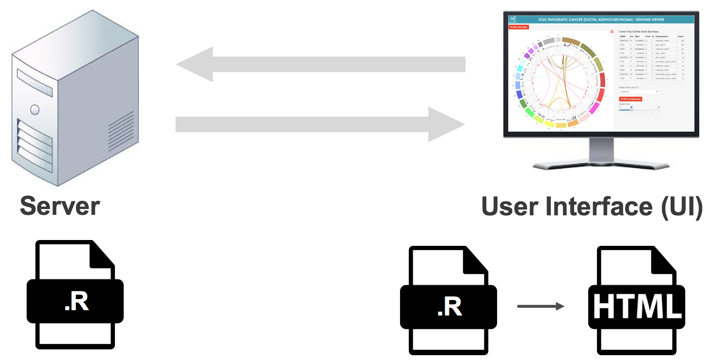

# Lesson 1 - Structure of R Shiny

## How Shiny works

A shiny app has two components: Server and UI (User Interface). Server is where the data manipulation happens, and UI defines what the application should look like. Each of them is coded in an R script (or multiple R scripts for complicated apps). The Server R Script calculates the data for every element (graphs or tables) in UI. The UI R script will populate an HTML file that contains all those elements and shows up in the browser.

